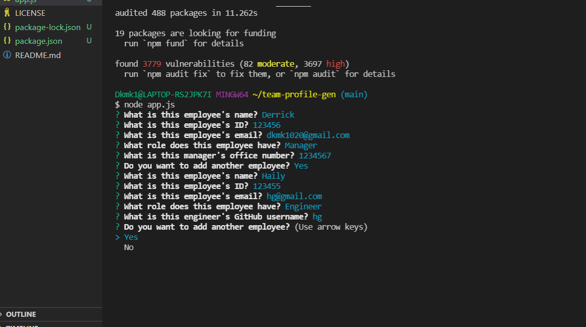

# team-profile-gen

## Description

The Team generator allows a user quickly generate a website showcasing their team of employees. The user is prompted with a list of questions that differs depending on the employee role.

#video demo
https://user-images.githubusercontent.com/77812181/126204587-055a1c9a-34f4-4395-ac06-76dc0390dd93.mp4

## Installation

Run the following command to install dependencies:

_npm install_

## Usage

To use this application run the app.js file in the terminal and answer a series of prompts.

## License

This project is licensed under MIT

## Contribution Guidelines

Currently there are no contribution guidelines for this repo.

## Tests

Run the following command in the terminal to run tests:

_npm test_

## Questions

If you have any questions regarding this repo, you may contact me at dkmk1020@gmail.com. To see my other work, follow this link: [GitHub](https://github.com/derrick1020/).
